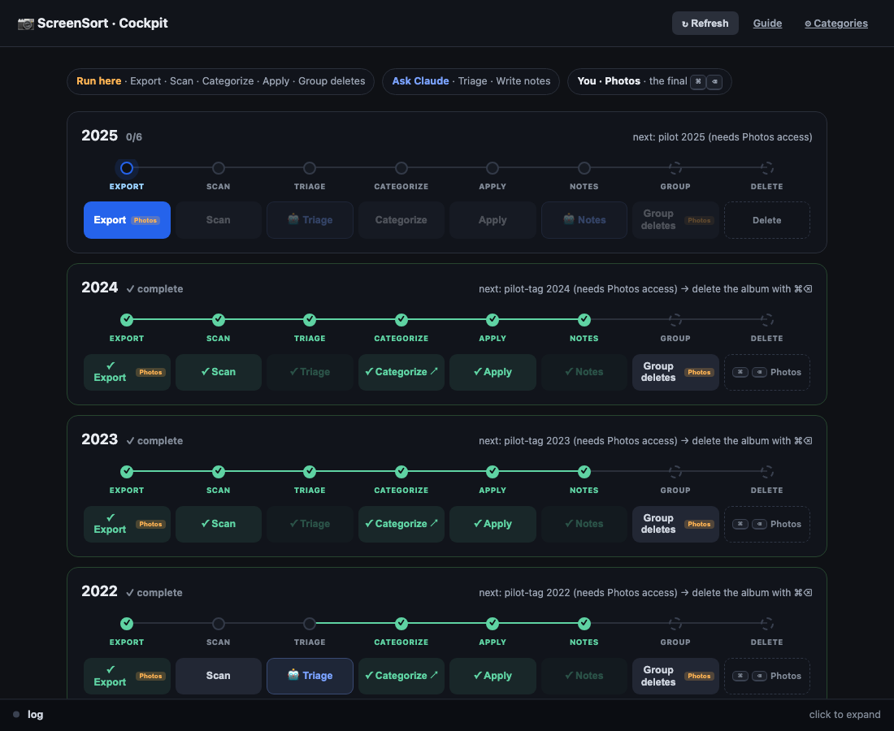

# 📷 ScreenSort

Turn your Apple **Photos screenshots** (the text-heavy ones) into organized **knowledge notes** — a batch at a time, with bilingual **Korean + English** OCR. It reads your screenshots read-only, drops near-duplicates, **flags anything sensitive and keeps it on your Mac**, lets AI pre-sort the rest, hands you a fast browser sorter to confirm, folds the keepers into topic notes, and only then helps you delete the junk from Photos (with a 30-day undo).

You drive the whole thing from **one local web page — the cockpit**. Nothing is ever deleted automatically; the final delete is always your own keystroke.



> ### ⚠️ Requirements at a glance
> - **macOS only.** It uses Apple Photos, Apple Vision OCR, and `sips` — there is no Linux/Windows version.
> - **The Photos app** with your screenshots in it (turn on iCloud Photos if they only live on your phone).
> - **Python 3.9+**.
> - **[Claude Code](https://claude.com/claude-code)** (or another agent) — two steps (AI **triage** and **writing the notes**) are done by Claude. Without it you can still sort manually, but you lose the AI assist.
> - **~5 minutes of setup** (mostly granting one macOS permission).

> ### 🔒 Privacy & permissions — read first
> - It needs **Full Disk Access** to read your **entire** Photos library (read-only — it never writes to or deletes from Photos).
> - **OCR runs locally** (Apple Vision); your images never leave your Mac.
> - During the optional AI **triage**, short OCR *snippets of non-sensitive items* are sent to Claude. The privacy scan first flags anything sensitive (IDs, cards, passwords) and **excludes it**; set `privacy.no_cloud` to skip the cloud step entirely and sort fully offline.
> - **No photo is ever deleted by the tool** — you delete by hand in Photos, into Recently Deleted (30-day undo).

---

## 1. Install (once)

```bash
git clone https://github.com/jiyae619/ScreenSort.git ~/screensort
cd ~/screensort
./install.sh
```

`install.sh` installs the Python dependencies (`osxphotos` + the `pyobjc` Apple-Vision bridge), adds two shell shortcuts, and links the Claude Code skill. If you prefer to do it by hand:

```bash
python3 -m pip install --user osxphotos pyobjc-framework-Vision pyobjc-framework-Quartz pyobjc-framework-Cocoa
```

### Grant Full Disk Access — the one step everyone forgets

Reading the Photos library is a protected macOS operation. The two steps that touch Photos (**Export** and **Group deletes**) need it:

1. **System Settings → Privacy & Security → Full Disk Access**
2. Add your **terminal app** (Terminal.app, iTerm, Warp…) and toggle it **on**.
3. **Fully quit and reopen** that terminal — the permission only applies to a freshly launched one.

In the cockpit this is labeled **“Photos access.”** If it’s missing, the cockpit shows a red banner telling you exactly this.

---

## 2. Launch the cockpit

```bash
python3 ~/screensort/src/serve.py
```

…or **double-click `ScreenSort.command`** in the `screensort` folder. Either opens **http://127.0.0.1:8765** in your browser. The server is **localhost-only** — nothing is exposed to the network. Leave the terminal window open while you work; closing it (or `Ctrl-C`) stops the cockpit.

> The cockpit is a **local server, not a saved web page** — the URL only responds while it’s running. Launch it whenever you want to work, close it when you’re done.

The page shows one **card per batch** (a year). Each card has a **progress tracker** (the connected dots — read-only) and a row of **action buttons** beneath it. The next button **pulses** — you can mostly just follow the glow.

---

## 3. The flow, step by step

Process **one batch (a year) at a time.** On its card, you’ll do these in order. Three of them are cockpit buttons, two are quick pings to Claude, and the last is your keystroke in Photos.

| # | Step | Who / where | What it does |
|---|------|-------------|--------------|
| 1 | **Export** 🟠 *Photos access* | Cockpit button | Reads that year’s screenshots, OCRs them locally (Korean + English), copies thumbnails. |
| 2 | **Scan** | Cockpit button | Drops near-duplicates and **privacy-scans** — anything sensitive (IDs, cards, passwords) is flagged and kept off the AI step. |
| 3 | **Triage** 🤖 | Claude | Click **Copy prompt**, paste to Claude. It pre-sorts every screenshot into a category, calibrated from your past decisions. *(Optional but recommended for big batches.)* |
| 4 | **Categorize** | Cockpit button → browser | Builds + opens the **sorter**. You confirm the uncertain rows + the delete pile, then **Save** (posts straight back to the cockpit). |
| 5 | **Apply** | Cockpit button | Folds your decisions into per-category text and writes a lossless raw-text archive. |
| 6 | **Write notes** 🤖 | Claude | Click **Copy prompt** (`apply <year> — write the notes`). Claude merges every kept item into your topic notes, by theme — nothing dropped. |
| 7 | **Group deletes** 🟠 *Photos access* | Cockpit button | Gathers the delete-marked screenshots into a Photos album **📦 Delete (year pilot)**. Non-destructive — favorites & sensitive items are never included. |
| 8 | **Delete** | You, in Photos | Open the album → **Select All** → **⌘⌫**. They go to Recently Deleted (30-day undo). |

> **The one rule that bites:** in Photos use **⌘⌫** (*Delete from Library*), **not** plain **⌫** (which only removes from the album and leaves the originals taking up space).

### The sorter (step 4) in 20 seconds
It opens **pre-sorted**, so you’re spot-checking, not filing from scratch. Each row = one screenshot (thumbnail · confidence dot · OCR preview · category dropdown · 🗑). With **🔎 needs-review-only** on (the default), you see just the uncertain rows + the delete pile. Click a thumbnail to zoom and file with **one key** (works with a Korean IME — it reads the physical key). Then **Save**.

---

## 4. Categories

Every screenshot is filed into exactly one:

| Category | For | | Category | For |
|---|---|---|---|---|
| **AI** | LLMs, prompting, agents | | **PLACES** | travel, maps, venues → kept as an album |
| **PM** | product craft, 기획, metrics | | **PROTECT** | IDs/payment — **never deleted** |
| **DESIGN** | UX/UI, design systems | | **REVIEW** | can’t tell — needs your eyes |
| **MINDSET** | psychology, self-development | | **DELETE** | junk, no reusable content |
| **CAREER** | job search, interviews, leadership | | | |
| **EVENTS** | talks, conferences, RSVPs | | | |
| **READING** | books, reading lists | | | |

The note categories (AI…READING) become knowledge notes; PLACES becomes an album; PROTECT is never touched; DELETE is what **Group deletes** stages.

**Categories aren’t fixed.** Edit them in the cockpit (**⚙ Categories** → add / rename / recolor / re-key, with live validation) or in `config.json`.

---

## 5. Privacy & safety

- **Your screenshots stay private.** OCR runs **locally** (Apple Vision — pixels never leave your Mac).
- **Sensitive content never reaches the cloud.** The Scan step flags IDs/cards/passwords and **excludes them from the AI triage entirely**. Set `privacy.redact_pii` to mask residual PII in snippets, or `privacy.no_cloud` to skip the AI step altogether and sort with local keyword seeding.
- **What *does* go to Claude:** short OCR snippets of the *non-sensitive* items, during triage. If that’s not acceptable for a batch, use `no_cloud`.
- **No script deletes a photo.** The only deletion is **you**, by hand, in Photos → Recently Deleted (30-day undo).
- **Favorites & PROTECT are never auto-deleted.**
- **The archive is lossless** — `text-extract/<year>-pilot/` holds verbatim OCR of every kept item, so deleting the images loses no text.

---

## 6. Where things live

Defaults (set in `lib.py`; see **Configuration** to change them):

| What | Path |
|---|---|
| Working files per batch | `~/Documents/Obsidian Vault/Screenshots/pilot/<year>/` |
| Cockpit, sorter, thumbnails | `~/Documents/Obsidian Vault/Screenshots/previews/` |
| Consolidated topic notes | `~/Documents/Obsidian Vault/Screenshots/summary/*.md` |
| Lossless archive | `~/Documents/Obsidian Vault/Screenshots/text-extract/<year>-pilot/` |

> Both roots are configurable — set `"paths": {"vault": "…", "previews": "…"}` in `config.json` to point them anywhere. They default to an Obsidian vault at `~/Documents/Obsidian Vault` with previews underneath it. Folders are created automatically if missing.

---

## 7. Configuration

The repo ships **`config.example.json`** — copy it to `config.json` and customize (`cp config.example.json config.json`). A built-in default in `lib.py` takes over if `config.json` is missing/invalid, so the pipeline never breaks. Your `config.json` is gitignored (it holds your paths + keywords).

- **`paths`** — where output lives: `vault` (pilot data, notes, archive) and `previews` (cockpit, sorter, thumbnails). Override either.
- **`categories`** — name, hotkey, color, `desc` (guides the AI), `keywords`, and a `role`. Four roles are reserved and must each appear once: `note`, `protect`, `review`, `delete`; `places` is optional.
- **`languages`** — OCR + sensitive-lexicon languages (ships `["en","ko"]`).
- **`privacy`** — `no_cloud` (skip the AI step) and `redact_pii` (mask PII in snippets).
- **`batch_unit`** — default batch mode: `year` · `date-range` · `album` · `folder`.
- **`output`** — note format/folder and Obsidian links.

Edit categories visually with **⚙ Categories** in the cockpit, or `python3 config_editor.py`.

---

## 8. Not using Apple Photos?

If your screenshots live in a folder (e.g. `~/Downloads`) instead of the Photos library:

```bash
python3 ~/screensort/src/export_folder.py ~/Downloads downloads 20   # folder · batch label · how many
```

It OCRs locally (Apple Vision, or tesseract — `brew install tesseract tesseract-lang` — as a fallback). Everything downstream is identical **except** the Photos steps: your delete list is `delete.txt` and you remove those files yourself.

---

## 9. Prefer the terminal? / Manual flow

Every cockpit button maps to a script you can run directly (`python3 ~/screensort/src/<script>.py <year>`):

`export.py` → `dedup.py` + `sensitive.py` → *(triage via Claude)* → `recat.py` → *(sort in browser)* → `apply.py` + `archive.py` → *(notes via Claude)* → `tag.py`.

**Lost?** `python3 ~/screensort/src/status.py <year>` prints which artifacts exist and exactly what to run next.

---

## 10. Troubleshooting

- **Export/Group-deletes fail / “Operation not permitted.”** Full Disk Access isn’t active. Grant it to your terminal, then **fully quit and reopen** it (the #1 gotcha), and launch the cockpit from *that* terminal. A cockpit launched from another app can’t read Photos.
- **`ModuleNotFoundError: osxphotos` / `Vision`.** Run the install command, and launch the cockpit with the same `python3` you installed into.
- **A button is greyed out.** Its prerequisite isn’t done yet (e.g. Apply needs saved decisions). If you just Saved in the sorter tab, switch back to the cockpit — it auto-refreshes; or hit **↻ Refresh**.
- **“I deleted from the album but the originals are still there.”** You used plain **⌫**, not **⌘⌫**. Reselect and press **⌘⌫**.
- **The cockpit URL won’t load.** The server isn’t running — relaunch it (it’s a local server, live only while its terminal is open).

---

*Human + AI by design: the AI proposes, you confirm, deletions are always yours.*
